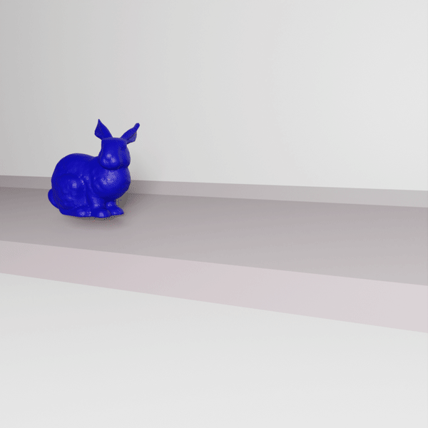
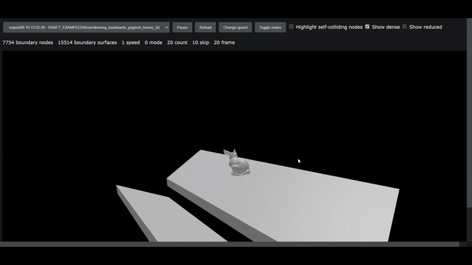

# conmech3d

conmech3d is a simulating package written in Python that allows to numerically solve contact mechanics problems. 

## Description

Contact mechanics describes behaviour of the physical body in contact with the obstacle. Majority of such problems cannot be solved analitically and require numerical procedure. This package implements the Finite Element Method for 3D and 2D bodies and works with static, quasistatic and dynamic problems. It can simulate various physical phenomena, such as friction and obstacle resistance. Additional variables besides displacement, such as the temperature of the body, can be calculated. The project is almost entirely self contained, requires basic Python libraries, [pygmsh](https://github.com/meshpro/pygmsh) along with [Gmsh](https://gmsh.info/) for mesh construction and [Scipy](https://scipy.org/) for solving reformulated problem. The code is modular and can be further extended to include new physical models.

## Sample results

| 3D with temperature (Blender) | 3D (three.js) | 2D with temperature (Matplotlib) 
:-------------------------:|:-------------------------:|:-------------------------:
 |  | 
<!-- | 3D with temperature (Blender) | 3D |S
 |   -->

## Installation

### Main functionality

Create a virtual environment (Python 3.10 is recommended)

    python -m venv .venv
    source .venv/bin/activate

Install Gmsh used for mesh construction 

    apt-get install python3-gmsh

Install JAX following the guide at https://github.com/google/jax#installation. For example, to use Nvidia GPU with self-installed CUDA 12, run

    pip install --upgrade "jax[cuda12_pip]" -f https://storage.googleapis.com/jax-releases/jax_cuda_releases.html

Install dependencies from "requirements.txt"

    pip install -r requirements.txt

### Additional dependencies required for tetrahedral skinning

Compile Cython files form folder cython_modules by running

    cd cython_modules
    python setup.py build_ext --inplace

### Additional dependencies required for GNN model

Install Pytorch. Only CPU version is required, as operations on GPU are performed using JAX. Follow the guide at https://pytorch.org/get-started/locally/. For example, to install Pytorch on Linux with CPU support run

    pip install torch --index-url https://download.pytorch.org/whl/cpu

Install dependencies from "requirements-deep.txt"

    pip install -r requirements-deep.txt

## Usage

To run sample simulations, start any file from the examples folder

    PYTHONPATH=. python examples/examples_3d.py

To run three.js server (by default on port 3003) run (this will start screen "three" running in the background)

    cd scripts
    ./three.sh

<!--

./examples.sh
screen -r examples

JAX
- CPU. GPU
- 32 vs 64 bit
- autograd

- Blender
- three
- matplotlib

# deep_conmech

deep_conmech uses Graph Neural Networks to learn dynamic contact mechanics simulations based on energy function implemented in conmech. It is implemented in [PyTorch](https://pytorch.org/) using [PyTorch Geometric](https://github.com/pyg-team/pytorch_geometric) library.

### Sample results

 | 
:-------------------------:|:-------------------------:

### Installation

Follow the instructions to install conmech, and then install additional dependencies by

    pip install -r requirements-deep.txt

### Usage

To generate training and validation sets, start the training process and periodically save learned model parameters, run

    PYTHONPATH=. python deep_conmech/run_model.py --mode=train

To generate sample trajectories using the most current saved model parameters, run

    PYTHONPATH=. python deep_conmech/run_model.py --mode=plot
  -->

