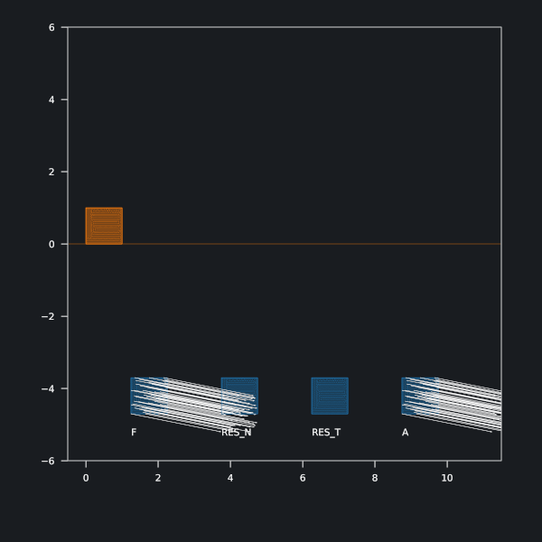

</img>

# conmech3d: simulations of contact mechanics in Python using [JAX](https://github.com/google/jax/tree/main)

## What is contact mechanics and conmech3d?

Contact mechanics models the behavior of physical bodies that come into contact with each other. It examines phenomena such as collisions, normal compliance, and friction. Most contact problems cannot be solved analytically and require a numerical procedure, such as the classical finite element method (FEM).

Conmech3d is an implementation of FEM for soft-body mechanical contact problems. The project is almost entirely self-contained and mainly aimed at research and didactic applications. Conmech3d is written in Python and uses [JAX](https://github.com/google/jax/tree/main), a library for high-performance numerical computing. Besides basic Python libraries, such as [Numpy](https://github.com/numpy/numpy) and [Scipy](https://scipy.org/), it also employs [pygmsh](https://github.com/meshpro/pygmsh) for mesh construction and [Numba](https://github.com/numba/numba) along with [Cython](https://github.com/cython/cython) to increase the speed of initial setup. Various options for visualization of simulation results are included, such as [Blender](https://github.com/blender/blender), [Three.js](https://github.com/mrdoob/three.js/) and [Matplotlib](https://github.com/matplotlib/matplotlib).

Experimental implementations of model reduction techniques that include tetrahedral skinning used in computer graphics and a new approach using Graph Neural Network are included in this repository.
<!-- PCA, Flax and Pytorch Geometric-->

## Features
* ability to solve both two- and three-dimensional simulations,
* static, quasistatic, and dynamic problems,
* a selection of constitutive laws, e.g. linearized elasticity, lineraized viscoelasticity and hiperelasticity,
* focus on general contact conditions describing friction and normal compliance,
* inclusion of additional phenomena, such as temperature.

Because Conmech3d is based on [JAX](https://github.com/google/jax/tree/main), it also offers
* support for simulations on CPU, GPU, and TPU,
* simple configuration of single (32-bit) and double (64-bit) modes of numerical precision,
* support for automatic differentiation and applications in machine learning.

## Sample results

| 3D with temperature (Blender) | 3D (three.js) | 2D with temperature (Matplotlib) 
:-------------------------:|:-------------------------:|:-------------------------:
 |  | 
<!-- | 3D with temperature (Blender) | 3D |S
 |   -->

## Installation

### Main functionality

Create a virtual environment (Python 3.10 is recommended)

    python -m venv .venv
    source .venv/bin/activate

Install Gmsh used for mesh construction 

    apt-get install python3-gmsh

Install JAX following the guide at https://github.com/google/jax#installation. For example, to use Nvidia GPU with self-installed CUDA 12, run

    pip install --upgrade "jax[cuda12_pip]" -f https://storage.googleapis.com/jax-releases/jax_cuda_releases.html

Install dependencies from "requirements.txt"

    pip install -r requirements.txt

### Additional dependencies required for tetrahedral skinning

Compile Cython files form folder cython_modules by running

    cd cython_modules
    python setup.py build_ext --inplace

### Additional dependencies required for GNN model

Install Pytorch. Only CPU version is required, as operations on GPU are performed using JAX. Follow the guide at https://pytorch.org/get-started/locally/. For example, to install Pytorch on Linux with CPU support run

    pip install torch --index-url https://download.pytorch.org/whl/cpu

Install dependencies from "requirements-deep.txt"

    pip install -r requirements-deep.txt

## Usage

To run sample simulations, start any file from the examples folder

    PYTHONPATH=. python examples/examples_3d.py

To run three.js server (by default on port 3003) run (this will start screen "three" running in the background)

    cd scripts
    ./three.sh

<!--

./examples.sh
screen -r examples

JAX
- CPU. GPU
- 32 vs 64 bit
- autograd

- Blender
- three
- matplotlib

# deep_conmech

deep_conmech uses Graph Neural Networks to learn dynamic contact mechanics simulations based on energy function implemented in conmech. It is implemented in [PyTorch](https://pytorch.org/) using [PyTorch Geometric](https://github.com/pyg-team/pytorch_geometric) library.

### Sample results

 | 
:-------------------------:|:-------------------------:

### Installation

Follow the instructions to install conmech, and then install additional dependencies by

    pip install -r requirements-deep.txt

### Usage

To generate training and validation sets, start the training process and periodically save learned model parameters, run

    PYTHONPATH=. python deep_conmech/run_model.py --mode=train

To generate sample trajectories using the most current saved model parameters, run

    PYTHONPATH=. python deep_conmech/run_model.py --mode=plot
  -->

